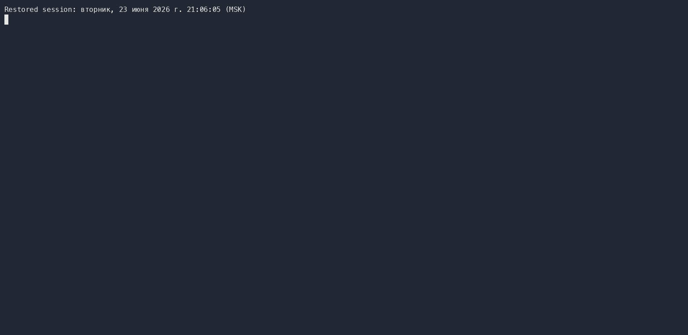
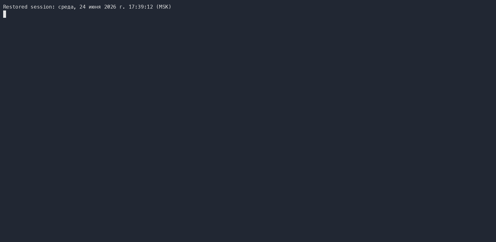

### Hexlet tests and linter status:
[](https://github.com/BelyiArtem/php-project-45/actions)
[](https://github.com/squizlabs/PHP_CodeSniffer)


[](https://sonarcloud.io/summary/new_code?id=BelyiArtem_php-project-45)
[](https://sonarcloud.io/summary/new_code?id=BelyiArtem_php-project-45)
[](https://sonarcloud.io/summary/new_code?id=BelyiArtem_php-project-45)
[](https://sonarcloud.io/summary/new_code?id=BelyiArtem_php-project-45)
[](https://sonarcloud.io/summary/new_code?id=BelyiArtem_php-project-45)

<h1 align="center">Project "Brain Games"</h1>
Project has 5 games: even number, calculator, greatest common divisor (GCD), arithmetic progression, prime number. <br>
The player must provide <b>three correct answers</b> in a row to win.

<b>Important: </b>any invalid input is considered an error and counts as an incorrect answer.

Installation
------------

Use [make] to install dependencies:

```bash
make install
```
After installing validate composer.json:

```bash
make validate
```
<div>
  Example
  
</div>

<details><summary><b>1. Even number</b></summary>
<b>The goal of a game is as follows:</b> a random number is displayed to the user. They must answer 'yes' if the number is even, or 'no' if it is odd.
  
Use [make] to run the game:
```bash
make brain-even
```

<div>
  <h4>Example (player win the game):</h4>
  
</div>

<div>
  <h4>Example (player failed the game):</h4>
  
</div>
</details>

<details><summary><b>2. Calculator</b></summary>
<b>The goal of a game is as follows:</b> a random mathematical expression is displayed to the user (e.g. 35 + 16) which they must solve and provide the correct answer.
  
Use [make] to run the game:
```bash
make brain-calc
```

<div>
  <h4>Example (player win the game):</h4>
  
</div>

<div>
  <h4>Example (player failed the game):</h4>
  
</div>
</details>

<details><summary><b>3. Greatest common divisor (GCD)</b></summary>
<b>The goal of a game is as follows:</b> two random numbers are displayed to the user (e.g. 25 50) which they must solve and provide the greatest common divisor.
  
Use [make] to run the game:
```bash
make brain-gcd
```

<div>
  <h4>Example (player win the game):</h4>
  
</div>

<div>
  <h4>Example (player failed the game):</h4>
  
</div>
</details>

<details><summary><b>4. Arithmetic progression</b></summary>
<b>Objective of the Game:</b> the game presents a numerical sequence to the player where one number is intentionally omitted and marked with an ellipsis (...). The player's task is to identify the missing number based on the given sequence pattern.

Example Scenario: Consider the sequence: 5 7 9 11 13 ... 17 19 21 23

The common difference between numbers is +2
The missing number in this case is 15

Use [make] to run the game:
```bash
make brain-progression
```

<div>
  <h4>Example (player win the game):</h4>
  
</div>

<div>
  <h4>Example (player failed the game):</h4>
  
</div>
</details>

<details><summary><b>5. Prime number</b></summary>
<b>Objective of the Game:</b> a random number is displayed to the user. They must answer 'yes' if the number is prime, or 'no'. The user must provide three correct answers in a row to win.

Use [make] to run the game:
```bash
make brain-prime
```

<div>
  <h4>Example (player win the game):</h4>
  
</div>

<div>
  <h4>Example (player failed the game):</h4>
  
</div>
</details>
